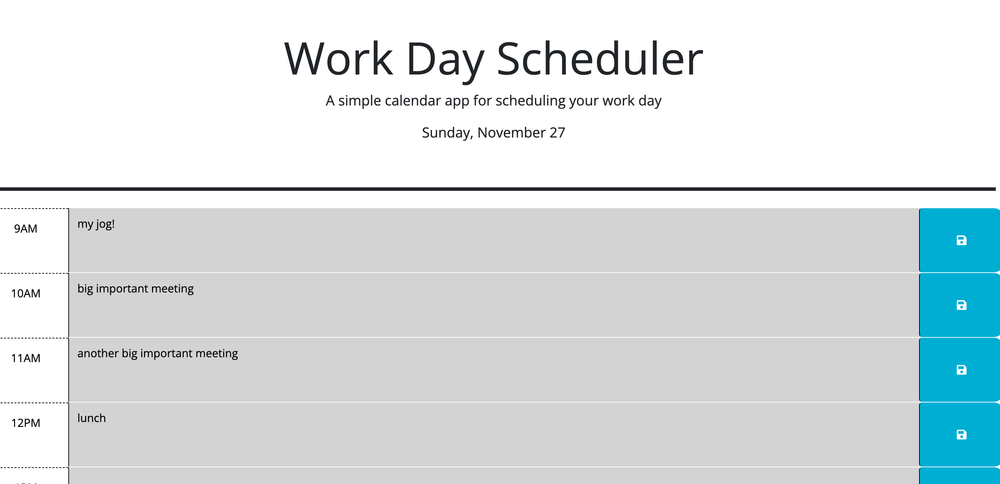

# <Work-Day-Scheduler>

## Description

My motivation for this project was to practice using jquery and utilize local storage to build a daily planner that allows a user to save events on an hourly basis.

## Usage

All the user has to do to use this webpage is type their hourly events into the text box next to the hour in which they will be attending/completing the event. Then, click the blue save button to the right of the text box to save the event

## License

MIT License

## Deployed Link